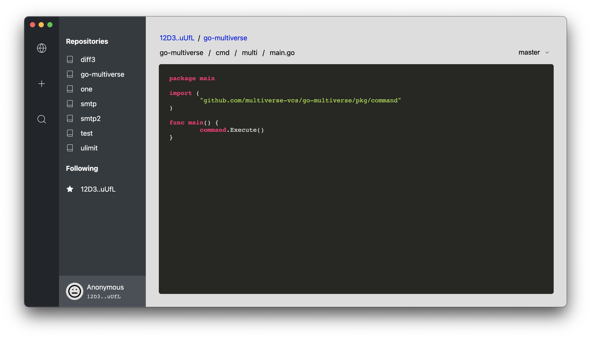

# Multiverse Desktop

[](https://gitter.im/multiverse-vcs/community?utm_source=badge&utm_medium=badge&utm_campaign=pr-badge)

Multiverse desktop is the easiest way to get started with Multiverse.



### Features

- Integrated code viewer. Browse repositories offline.
- Follow peers to stay up to date on repository changes.
- Issues, pull requests, and more coming soon.

### Building

```bash
$ git clone https://github.com/multiverse-vcs/desktop.git
$ cd desktop
$ ./download.sh
$ npm install
$ npm start
```
### Contributing

Found a bug or have a feature request? [Open an issue](https://github.com/multiverse-vcs/desktop/issues/new).

Multiverse follows the [Contributor Covenant](https://contributor-covenant.org/version/2/0/code_of_conduct/) Code of Conduct.

### License

GNU Affero General Public License v3.0
